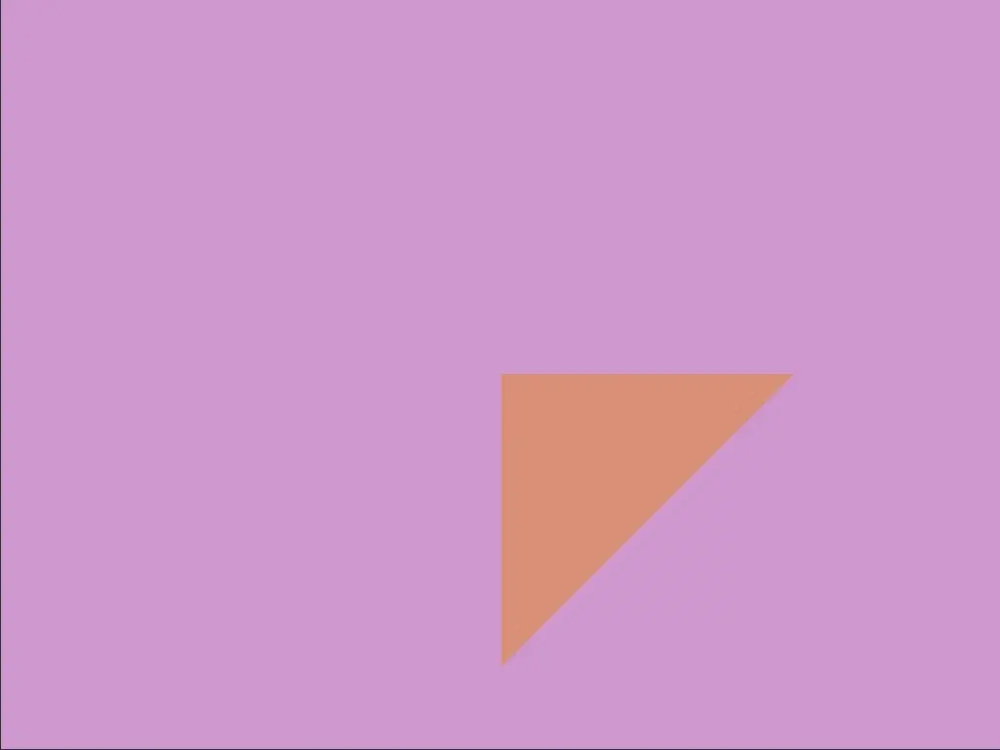

rust-art
===

place to mess around with nannou visualisations.

# Heighway dragon

Following [the folding algorithm described on Wikipedia](https://en.wikipedia.org/wiki/Dragon_curve#Folding_the_dragon) and the coloring idea from [cfox's quilt](https://web.mit.edu/cfox/www/quilting/dragon-curve.html) (upstream source for that [Larry Riddle](https://larryriddle.agnesscott.org/ifs/heighway/heighway.htm)). Having weird thoughts about winding as a result of this coloring idea.

